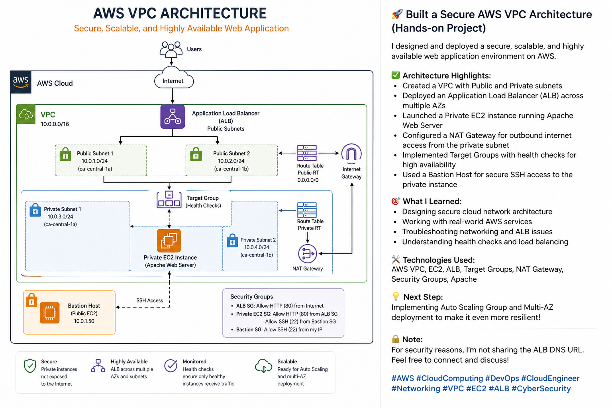
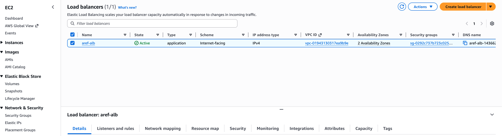
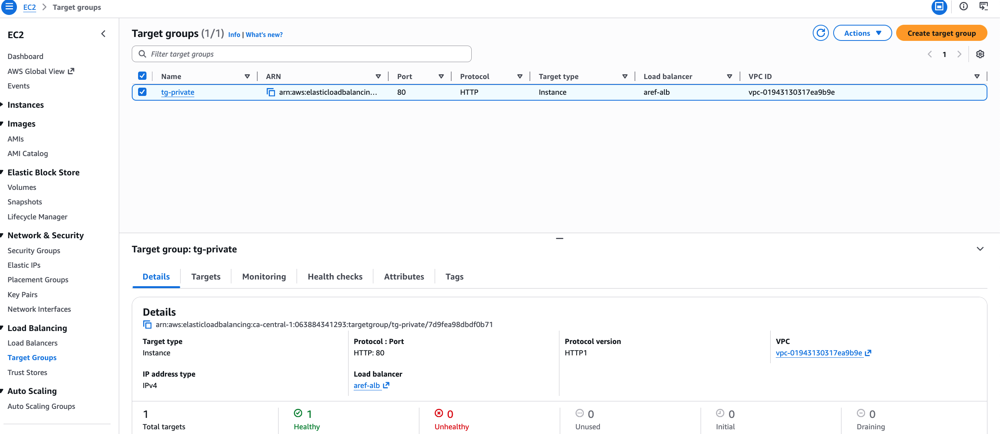

# AWS VPC Architecture with ALB (Hands-on Project)

## Overview
This project demonstrates the design and implementation of a secure AWS architecture using public and private subnets.

## Architecture

## Key Components
- Amazon VPC with public and private subnets
- EC2 Bastion Host for secure SSH access
- Private EC2 instance running Apache Web Server
- NAT Gateway for outbound internet access
- Application Load Balancer (ALB)
- Target Group with health checks
- Security Groups for controlled access

## Traffic Flow
Internet → ALB → Private EC2

## Security Design
- No direct public access to private EC2
- SSH access only via Bastion host
- ALB communicates with backend via Security Group rules

## Screenshots

### ALB

### Target Group

## Technologies Used
- AWS VPC
- EC2
- ALB
- NAT Gateway
- Security Groups
- Apache

## What I Learned
- Designing secure AWS network architecture
- Implementing private subnet isolation
- Configuring ALB and troubleshooting health checks
- Working with real-world cloud scenarios
